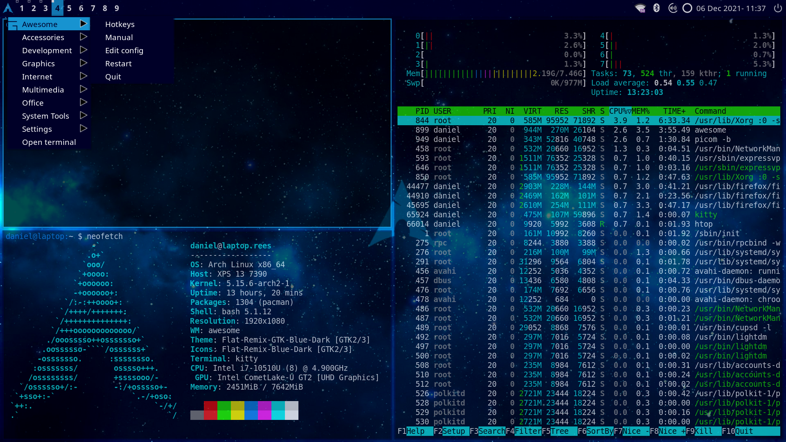

# Arch Blue theme

This is my configuration with theme for Awesome WM based on the Arch blue (**#1793d0**). It was developed for use on Awesome 4.3+. It is intentionally simple based on my personal style preferences but should also serve as a good base for further customization by individual users.

## Screenshots

Normal screenshot:


With hotkeys popup menu:


## Installation

Clone the repo and copy to ```~/.config/awesome/```. Ensure you make a backup of any existing ```rc.lua``` first. Then ensure that you have the necessary dependencies (please see below).

## Dependencies

Please check that you have the relevant dependencies installed first before trying to use the theme and ```rc.lua```.

### Menus

The ```rc.lua``` creates a Freedesktop.org applications menu similar to those found in desktop environments. This uses **awesome-freedesktop** which is available in the AUR as ```awesome-freedesktop-git```.

### Widgets

The ```rc.lua``` includes the **batteryarc**, **volume** and **logout_menu** widgets from https://github.com/streetturtle/awesome-wm-widgets. Please follow the instructions on that page to clone the repo so the directory ```awesome-wm-widgets``` is in your ```~/.config/awesome/``` directory as this is the assumed location in ```rc.lua```. You do not need to install/keep all the plugins, only those referenced in ```rc.lua```.

### Default applications

The theme assumes the following default applications:
- **Terminal** - [kitty](https://sw.kovidgoyal.net/kitty/)
- **Editor** - [vim](https://www.vim.org/)
- **Web browser** - [Firefox](https://www.mozilla.org/en-US/firefox/new/)
- **Mail** - [Mutt](http://www.mutt.org/)

Otherwise, please edit the rc.lua if you have different preferences.

### Media and brightness control

The configuration file maps key bindings to the play, next and previous keys identified by X.org and uses [playerctl](https://github.com/altdesktop/playerctl) to control my mpd server. Replace ```playerctl``` in ```rc.lua``` if you want to use an alternative application to control media playback.

Similarly the brightness controls are mapped to ```xbacklight```.

### Autorun applications

The autorun script loads the following on startup of Awesome.
- **picom** - the Picom compositor for X.org window managers (addinng transparency and other effects). Install ```picom```.
- **nm-applet** - Network Manager WIFI applet. Install ```network-manager-applet```
- **blueman-applet** - Bluetooth manager. Comes with ```blueman``` by default.
- **light-locker** - display lock for use with [lightdm](https://wiki.archlinux.org/title/LightDM). Install ```light-locker```.

## Wallpaper

The wallpaper is referred to the background.png file in the theme directory. I downloaded it from [here](https://getwallpapers.com/wallpaper/full/1/c/b/49249.jpg) and made some adjustments i Gimp (as it looked too washed out for me). As I am not able to verify the licence terms, please download it directly or use another wallpaper saved as ```themes/archblue/background.png```.

## Wider configuration options

My setup uses the [Flat-Remix-Blue-Dark](https://drasite.com/flat-remix) GTK theme. A package is available in the AUR as ```flat-remix-gtk```. I use [qt5ct](https://wiki.archlinux.org/title/Qt#Configuration_of_Qt5_apps_under_environments_other_than_KDE_Plasma) to maintain consistency in QT applications, using the 'gtk2' option. I also use the ```flat-remix``` icon theme avaialble in the AUR.
